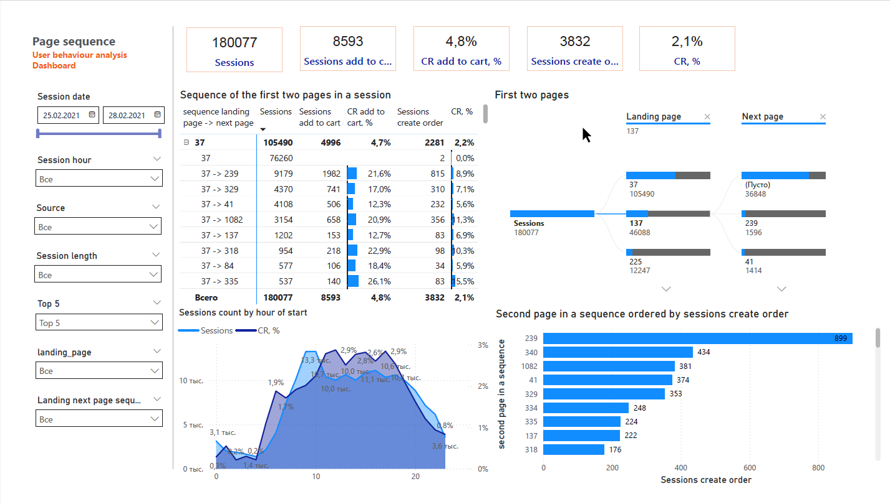

# 📊 User Behavior Analysis Dashboard

## 📌 Project: Usability Audit of Landing Pages

### 🧾 Overview

This project focuses on performing a **usability audit of the Top 5 landing pages** by traffic volume. The goal is to identify **user navigation patterns** that lead to conversions and provide recommendations to **optimize user flows** for higher session conversion and lower bounce rates.

The analysis includes:
- User navigation sequences: **landing page → next page**
- Metrics:
  - Total sessions
  - Sessions with add-to-cart action
  - Sessions with completed orders
  - Conversion rates at each step

### 🛠️ Tools

- **Power BI** for interactive visual reporting  
- **DAX** for KPI calculations  
- **SQL** for data preparation  
---

## 📈 Key Metrics

- Total sessions: **180,077**
- Sessions with add to cart: **8,593** (CR: 4.8%)
- Sessions with completed orders: **3,832** (CR: 2.1%)

### 🔝 Top 5 Landing Pages

| Landing Page | Sessions | Orders | CR (%) |
|--------------|----------|--------|--------|
| 37           | 105,490  | 2,281  | 2.2%   |
| 137          | 46,088   | 867    | 1.9%   |
| 225          | 12,247   | 186    | 1.5%   |
| 318          | 9,825    | 237    | 2.4%   |
| 160          | 6,427    | 261    | 4.1%   |

---

## 🖼️ Dashboard Screenshot




---

## 📁 Project Structure

```
📂 user-behavior-analysis/
├── 📊 User Behaviour Analysis.pbix
├── 📸 Screenshots
├── 📑 README.md
└── 📁 sql/
    └── query.sql
```
